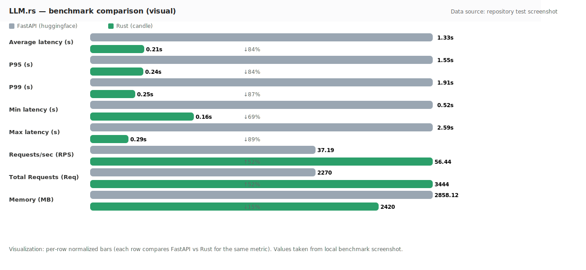

# LLM.rs（中文）

[English / README.md](./README.md)

---

## 🔥 性能基准测试

LLM.rs 已与基于 FastAPI 的嵌入服务进行基准测试，以展示其性能优势：

<p align="center">
  
</p>

**关键性能指标：**
- **平均延迟 (s)：** FastAPI 1.33 → Rust 0.21（↓84%）
- **P95 延迟 (s)：** FastAPI 1.55 → Rust 0.24（↓84%）
- **P99 延迟 (s)：** FastAPI 1.91 → Rust 0.25（↓87%）
- **最小延迟 (s)：** FastAPI 0.52 → Rust 0.16（↓69%）
- **最大延迟 (s)：** FastAPI 2.59 → Rust 0.29（↓89%）
- **每秒请求数 (RPS)：** FastAPI 37.19 → Rust 56.44（↑52%）
- **处理的总请求数：** FastAPI 2270 → Rust 3444（↑52%）
- **内存使用 (MB)：** FastAPI 2858.12 → Rust 2420（约 ↓15%）

---

## 项目简介

LLM.rs 是基于 Rust 的高性能 embedding 服务，提供 OpenAI 兼容的 `/v1/embeddings` 接口，内置队列与并发控制，支持可插拔的推理后端（本地 candle 或代理到 Python 服务）。

### 主要功能
- OpenAI 兼容接口 `/v1/embeddings`
- 可插拔后端（candle / Python proxy / future: vLLM）
- 内置队列、批处理与并发控制
- 面向生产的性能优化与低资源占用
- 通过配置支持多种模型

---

## 如何使用

### 1. Docker 使用

#### 拉取 Docker 镜像
```bash
# 从 Docker Hub 拉取最新镜像
docker pull h20260224/llmrs:latest
```

#### 运行 Docker 容器
```bash
# 使用默认配置运行容器
docker run -d -p 3000:3000 --name llmrs h20260224/llmrs:latest

# 使用自定义环境变量运行
docker run -d -p 3000:3000 --name llmrs \
  -e HOST=0.0.0.0 \
  -e PORT=3000 \
  -e BACKEND_URL=http://127.0.0.1:8000 \
  -e MODEL_NAME=your-model-name \
  h20260224/llmrs:latest

# 使用 config.toml 文件运行
docker run -d -p 3000:3000 --name llmrs \
  -v ./config.toml:/app/config.toml \
  h20260224/llmrs:latest
```

### 2. 启动与模型配置

#### 前置条件
- 已安装 Rust（见 [Linux 构建环境](#linux-构建环境) 中的安装说明）
- 后端模型服务已运行（例如，带有嵌入模型的 Python 服务）

#### 基本启动
```bash
# 构建并运行服务
cargo build
cargo run
```

#### 自定义启动参数
您可以使用环境变量配置服务：

```bash
# 示例：使用自定义端口、后端 URL 和模型名称启动
HOST=0.0.0.0 PORT=8080 BACKEND_URL=http://127.0.0.1:8000 MODEL_NAME=your-model-name cargo run
```

#### 配置选项

**环境变量：**
- `HOST` - 服务器主机（默认：127.0.0.1）
- `PORT` - 服务器端口（默认：3000）
- `BACKEND_URL` - 后端模型服务 URL（默认：http://127.0.0.1:8000）
- `MODEL_NAME` - 要使用的模型名称（默认：your-model-name）
- `NORMALIZE_EMBEDDINGS` - 是否归一化嵌入（默认：true）
- `BATCH_SIZE` - 处理请求的批大小（默认：32）
- `WORKERS` - 工作线程数（默认：1）
- `QUEUE_CAPACITY` - 最大队列容量（默认：100）

**使用 config.toml 文件：**
在项目根目录创建 `config.toml` 文件：
```toml
# config.toml
host = "127.0.0.1"
port = 3000
backend_url = "http://127.0.0.1:8000"
model_name = "your-model-name"
normalize_embeddings = true
batch_size = 32
workers = 1
queue_capacity = 100
```

#### 模型切换
要切换模型，只需更新 `MODEL_NAME` 环境变量或 config.toml 设置：

```bash
# 示例：切换到不同模型
MODEL_NAME=new-model-name cargo run
```

### 3. RESTful API 使用

#### 健康检查
```bash
# 检查服务状态
curl http://127.0.0.1:3000/health
```

响应示例：
```json
{
  "status": "ok",
  "backend_url": "http://127.0.0.1:8000",
  "model_name": "your-model-name"
}
```

#### 嵌入 API（兼容 OpenAI）
```bash
# 获取文本的嵌入
curl -X POST http://127.0.0.1:3000/v1/embeddings \
  -H "Content-Type: application/json" \
  -d '{"input":["你好", "世界"], "model":"your-model-name", "encoding_format":"float"}'
```

请求格式：
```json
{
  "input": ["text1", "text2"],  // 要嵌入的文本数组
  "model": "your-model-name",  // 模型名称
  "encoding_format": "float"  // 输出格式：float 或 base64
}
```

#### 传统 Embed API
```bash
# 使用传统端点获取嵌入
curl -X POST http://127.0.0.1:3000/embed \
  -H "Content-Type: application/json" \
  -d '{"texts":["你好", "世界"], "normalize_embeddings":true, "batch_size":32}'
```

---

## 模型支持

LLM.rs 设计为通过可插拔的后端架构支持多种嵌入模型：

### 当前支持
- **多样化模型兼容性** - 通过配置支持广泛的嵌入模型

### 未来计划
- 通过配置扩展支持更多模型
- 为更多模型提供本地推理后端
- 模型特定的配置选项

---

## Linux 构建环境

### 推荐用法
1. 安装必要的依赖和 Rust：
   
   ```bash
   sudo apt update && sudo apt install -y build-essential curl
   curl --proto '=https' --tlsv1.2 -sSf https://sh.rustup.rs | sh
   ```
   
2. 克隆仓库并构建项目：
   
   ```bash
   git clone <repository-url>
   cd LLM.rs
   cargo build
   ```

> 说明：本项目首选 Linux 作为开发和部署环境，因为大多数服务器操作系统都是基于 Linux 的。

---

## 后续计划
- 本地推理后端（candle/tch-rs），已预留可插拔接口
- 更完整的模型配置与切换
- 性能指标与监控

## 贡献
欢迎提交 issue/PR。请在 PR 中附带复现步骤与性能数据（截图或 CSV）。